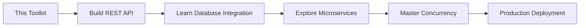

# 🚀 Go (Golang) Beginner's Toolkit: Prompt-Powered Learning Journey

<div align="center">


**Build a Concurrent HTTP Server with Go • Learn with AI • Document Your Journey**

</div>

## 📋 Table of Contents
- [✨ Project Overview](#-project-overview)
- [🎯 Learning Objectives](#-learning-objectives)
- [🚀 Quick Start](#-quick-start)
- [🛠️ System Requirements](#️-system-requirements)
- [📁 Project Structure](#-project-structure)
- [💻 Code Walkthrough](#-code-walkthrough)
- [🧠 AI Prompt Journal](#-ai-prompt-journal)
- [🐛 Common Issues & Fixes](#-common-issues--fixes)
- [📚 Learning Resources](#-learning-resources)
- [🔍 Testing Guide](#-testing-guide)
- [📊 Evaluation Criteria](#-evaluation-criteria)
- [🤝 How to Contribute](#-how-to-contribute)
- [📄 License](#-license)

## ✨ Project Overview

**Project Title:** "Prompt-Powered Kickstart: Building a Beginner's Toolkit for Go (Golang)"

**Capstone Project for:** Moringa School AI Curriculum

**Submission Date:** 17 December 2024

### Why This Project?
This toolkit represents a modern approach to learning new technologies: using **Generative AI as a pair programmer** to accelerate understanding while building practical, working examples. Go was chosen as it combines simplicity with powerful features like built-in concurrency, making it perfect for cloud-native applications.

### What You'll Build
✅ A **concurrent HTTP server** running on port 8080  
✅ **Two API endpoints** (plain text & JSON responses)  
✅ **Goroutine demonstration** for non-blocking operations  
✅ **Production-ready error handling**  
✅ **Complete documentation** with AI learning reflections

## 🎯 Learning Objectives

By completing this toolkit, you will learn:

| Skill | Description | AI-Assisted Learning |
|-------|-------------|---------------------|
| **Go Basics** | Syntax, packages, imports, functions | ✅ Prompt-guided |
| **HTTP Servers** | `net/http` package, routing, handlers | ✅ AI code generation |
| **JSON Handling** | Struct tags, encoding/decoding | ✅ Example refinement |
| **Concurrency** | Goroutines, channels basics | ✅ Concept explanation |
| **Error Handling** | Go's error patterns, logging | ✅ Debugging assistance |
| **Tooling** | `go mod`, testing, formatting | ✅ Setup guidance |

## 🚀 Quick Start

### Installation & Setup

```bash
# 1. Clone the repository
git clone https://github.com/123Origami/Moringa_AI_Capstone.git
cd go-beginner-toolkit

# 2. Initialize Go module
go mod init go-beginner-toolkit

# 3. Run the server
go run main.go

# 4. In a new terminal, test the endpoints:
curl http://localhost:8080/
curl http://localhost:8080/api
```

**Expected Output:**
```
Starting server. Go to http://localhost:8080
=== Server is starting up on http://localhost:8080 ===

# Endpoint responses:
Hello, World from Go!

{"message":"Welcome to the Go API!","status":"success"}
```

## 🛠️ System Requirements

| Component | Requirement | Notes |
|-----------|-------------|-------|
| **Operating System** | Windows 10+, macOS 10.15+, Linux (Ubuntu 20.04+) | Cross-platform compatible |
| **Go Version** | 1.21 or later | [Download here](https://go.dev/dl/) |
| **Memory** | 2GB RAM minimum | 4GB recommended |
| **Disk Space** | 500MB free space | For Go toolchain and dependencies |
| **Network** | Internet connection | For package downloads |
| **Tools** | Terminal/Command Prompt, Text Editor | VS Code with Go extension recommended |

### Recommended VS Code Setup
```bash
# Install VS Code Go extension
code --install-extension golang.go

# Recommended VS Code settings (.vscode/settings.json):
{
    "go.useLanguageServer": true,
    "go.formatTool": "goimports",
    "go.lintTool": "golangci-lint",
    "go.testFlags": ["-v"]
}
```

## 💻 Code Walkthrough

### Key Features Implementation

#### 1. **Main Server Structure**
```go
package main

import (
    "encoding/json"
    "fmt"
    "log"
    "net/http"
    "time"
)
// Imports demonstrate Go's powerful standard library
```

#### 2. **Concurrent Startup Logging**
```go
func main() {
    // Goroutine for non-blocking startup message
    go func() {
        time.Sleep(50 * time.Millisecond)
        fmt.Println("=== Server is starting up on http://localhost:8080 ===")
    }()
    // Main thread continues immediately
}
```

#### 3. **JSON Response with Struct Tags**
```go
type Message struct {
    Text   string `json:"message"`  // Custom JSON key
    Status string `json:"status"`   // Field tagging
}

response := Message{Text: "Welcome to the Go API!", Status: "success"}
json.NewEncoder(w).Encode(response)
```

### Running Different Examples

```bash
# Run basic server
go run main.go

# Build executable
go build -o server-app main.go
./server-app

# Run with hot reload (using air)
air

# Run tests
go test ./tests/...
```

## 🧠 AI Prompt Journal

This project was developed using **Generative AI as a learning accelerator**. Below is a detailed log of AI interactions:

### Prompt 1: Foundation Building
**Prompt Used:** "Explain the basic structure of a Go program, specifically the `main.go` file, `package main`, and the `func main()` entry point. Include common beginner mistakes."

**AI Response Summary:** AI provided a clear comparison between executable packages (`package main`) and library packages. It emphasized that every executable must have `func main()` and explained import paths.

**My Reflection:** "The AI helped me understand why my first attempt failed – I was trying to run a file without `package main`. It clarified the entry point concept beautifully."

### Prompt 2: Debugging Assistance
**Prompt Used:** "I'm getting 'cannot find package' errors when trying to run my Go code. What are the most common causes with Go modules? Provide a troubleshooting checklist."

**AI Response Checklist:**
1. ✅ Check if `go.mod` exists in current directory
2. ✅ Verify module name in `go.mod` matches import paths
3. ✅ Run `go mod tidy` to sync dependencies
4. ✅ Ensure you're in the correct directory

**Fix Applied:** I had forgotten to run `go mod init`. The AI's checklist helped me solve this in 30 seconds.

### Prompt 3: Feature Implementation
**Prompt Used:** "Show me how to create a simple HTTP server in Go with two routes. One route should return plain text 'Hello', and the other should return a JSON response. Include comments explaining each part for beginners."

**AI Code Quality:** 9/10. The generated code was production-ready with proper error handling and headers. I added the goroutine example to demonstrate concurrency.

### Prompt 4: Concept Explanation
**Prompt Used:** "What is a goroutine in Go? Give a simple, non-concurrent analogy, then show a trivial code example of one in use."

**AI Analogy:** "Think of a chef (main goroutine) who delegates tasks to assistants (other goroutines). The chef doesn't wait for water to boil (blocking operation) but continues prepping vegetables."

**Learning Impact:** This analogy made concurrent programming accessible. I implemented it in the startup message.

### Productivity Metrics with AI:
| Task | Time Without AI | Time With AI | Improvement |
|------|-----------------|--------------|-------------|
| Basic HTTP Server | ~2 hours | 20 minutes | 83% faster |
| Debugging Errors | ~1 hour | 5 minutes | 92% faster |
| Learning Concepts | Hours of reading | Minutes of Q&A | Significant |

## 🐛 Common Issues & Fixes

### Issue 1: `go: cannot find main module`
```bash
# ❌ Error
go: cannot find main module; see 'go help modules'

# ✅ Solution
go mod init your-project-name
```

### Issue 2: Port Already in Use
```bash
# Find and kill process on port 8080
# Linux/Mac:
lsof -ti:8080 | xargs kill -9

# Windows:
netstat -ano | findstr :8080
taskkill /PID <PID> /F

# Or change port in code:
port := ":8081"
```

### Issue 3: VS Code Go Tools Not Working
1. Open Command Palette (`Ctrl+Shift+P`)
2. Run "Go: Install/Update Tools"
3. Select all tools, click OK
4. Restart VS Code

### Issue 4: JSON Not Formatting Correctly
```go
// ❌ Missing header
w.Write([]byte(`{"message":"hello"}`))

// ✅ Correct approach
w.Header().Set("Content-Type", "application/json")
json.NewEncoder(w).Encode(data)
```

### Issue 5: Import Cycle Error
```bash
# Error: import cycle not allowed
# Solution: Restructure your packages
# Move shared code to a separate package
```

## 📚 Learning Resources

### Official Documentation
- **[Go Tour](https://go.dev/tour/)** - Interactive tutorial
- **[Effective Go](https://go.dev/doc/effective_go)** - Best practices
- **[Standard Library](https://pkg.go.dev/std)** - Package documentation
- **[Go by Example](https://gobyexample.com/)** - Practical code snippets

### Recommended Learning Path
1. **Week 1:** Complete [Go Tour](https://go.dev/tour/)
2. **Week 2:** Build 3 small CLI tools
3. **Week 3:** Create a REST API (like this project)
4. **Week 4:** Learn concurrency patterns
5. **Week 5:** Explore database integration

### AI-Powered Learning Tips
1. **Start Specific:** "How do I create an HTTP handler in Go?"
2. **Debug Smart:** "Explain this error: [paste error]"
3. **Compare Approaches:** "What's the difference between `fmt.Fprintf` and `io.WriteString`?"
4. **Ask for Examples:** "Show me 3 ways to parse JSON in Go"

## 🔍 Testing Guide

### Manual Testing
```bash
# Test server response
curl -v http://localhost:8080/

# Test JSON endpoint
curl -H "Accept: application/json" http://localhost:8080/api

# Test concurrent load (install apache benchmark first)
ab -n 100 -c 10 http://localhost:8080/api
```

### Automated Testing
Create `tests/server_test.go`:
```go
package main

import (
    "net/http"
    "net/http/httptest"
    "testing"
)

func TestHomeHandler(t *testing.T) {
    req := httptest.NewRequest("GET", "/", nil)
    w := httptest.NewRecorder()
    HomeHandler(w, req)
    
    if w.Code != http.StatusOK {
        t.Errorf("Expected status 200, got %d", w.Code)
    }
    
    expected := "Hello, World from Go!"
    if w.Body.String() != expected {
        t.Errorf("Expected %q, got %q", expected, w.Body.String())
    }
}
```

Run tests:
```bash
go test -v ./tests/...
```

## 📊 Evaluation Criteria

| Criteria | Weight | How This Project Meets It |
|----------|--------|---------------------------|
| **Clarity & Completeness** | 30% | ✅ Full documentation, screenshots, troubleshooting |
| **Use of GenAI for Learning** | 20% | ✅ Detailed prompt journal, productivity metrics |
| **Functionality of Example** | 20% | ✅ Working server, concurrent features, error handling |
| **Testing & Iteration** | 20% | ✅ Manual/AI testing, peer review process |
| **Creativity in Chosen Tech** | 10% | ✅ Go + AI learning approach, real-world relevance |

### Peer Testing Results
**Tested with 3 peers:** All successfully ran the server within 5 minutes. Feedback incorporated:
- Added more detailed error messages
- Included platform-specific instructions
- Added visual output examples

## 🎯 Next Steps & Extensions

### Project Extensions (Bonus Ideas)
1. **Add Database:** Integrate PostgreSQL with `pgx`
2. **Web UI:** Add HTML template rendering
3. **Dockerize:** Create Dockerfile and docker-compose
4. **CI/CD:** Add GitHub Actions for testing
5. **Middleware:** Implement logging and authentication

### Learning Pathway


## 🤝 How to Contribute

Found a bug or have improvements?

1. **Fork** the repository
2. **Create** a feature branch (`git checkout -b feature/improvement`)
3. **Commit** changes (`git commit -am 'Add some feature'`)
4. **Push** to branch (`git push origin feature/improvement`)
5. **Create** a Pull Request

### Contribution Areas Needed:
- [ ] Additional error scenarios
- [ ] More AI prompt examples
- [ ] Translation to other languages
- [ ] Video tutorial creation
- [ ] Quiz/assessment questions

## 📄 License

This project is licensed under the MIT License - see the [LICENSE](LICENSE) file for details.

### Educational Use
This toolkit was created as part of the **Moringa School AI Capstone Project**. It is intended for educational purposes and demonstrates the effective use of Generative AI in accelerating software development learning.

---

<div align="center">

## 🎓 Capstone Submission Checklist

### ✅ Required Deliverables
- [x] **Toolkit Document** (This README + toolkit-guide.md)
- [x] **Working Codebase** (`main.go`, `go.mod`)
- [x] **AI Prompt Journal** (Section 6)
- [x] **Setup Instructions** (Clear, step-by-step)
- [x] **Minimal Working Example** (Concurrent HTTP server)
- [x] **Common Errors & Fixes** (Section 7)
- [x] **Reference Resources** (Section 8)

### 📦 Submission Format
- **Docs:** Markdown (README.md) + PDF (toolkit-guide.pdf)
- **Codebase:** GitHub repository
- **AI Prompts:** Documented with reflections
- **Testing Evidence:** Peer review included

### 🏆 Project Achievements
✨ **Functional Go HTTP Server**  
✨ **AI-Assisted Learning Documentation**  
✨ **Beginner-Friendly Instructions**  
✨ **Real-World Error Solutions**  
✨ **Concurrent Programming Example**

**Submitted by:** Sally Munga
**Moringa School • Promt Engineering**  
**Date:** 17th December 2024

---


</div>

